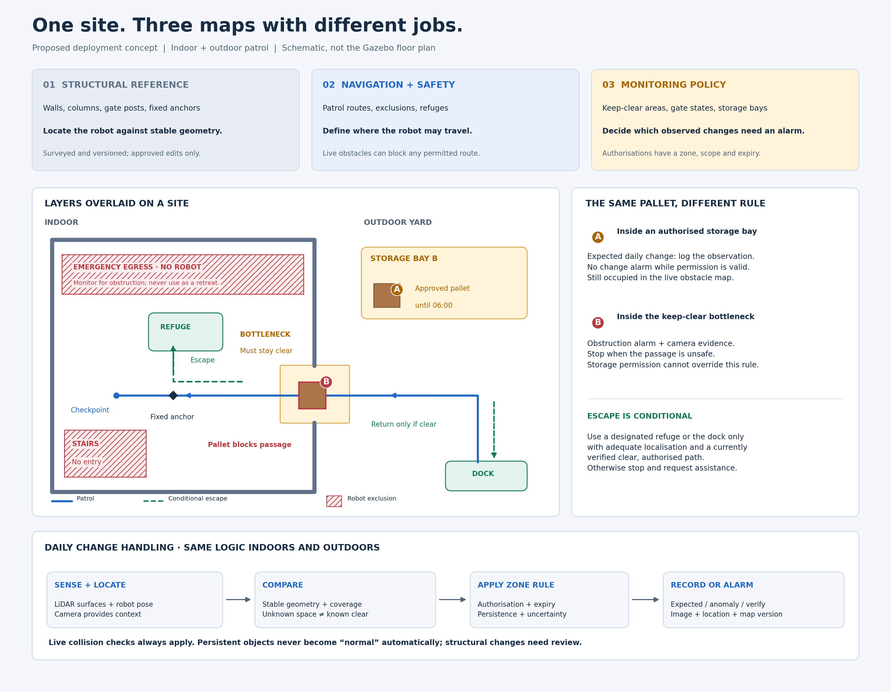

# Autonomous Patrol Pilot — integration-engineering response

## Assumptions

1. The site has a lawful security-surveillance basis and has completed the required local privacy assessment; this is not legal advice.
2. “Eight laps in 24 hours” means eight scheduled attempts every calendar day, including a 30–31-day month. The contractual interpretation of a partial lap must be agreed: below I count a lap only when its planned route is completed.
3. The robot has a safe-stop capability, authenticated software updates, onboard time synchronisation, and a remotely accessible telemetry API. These are acceptance prerequisites, not facts supplied by the case.

## 1. Mapping and localisation concept

### Sketch: layers, exclusion zones and escape routes

[Open full-size sketch](mapping_layers_concept.png) · [Editable vector version](docs/mapping_layers_concept.svg)

This is a **proposed deployment architecture**, not a drawing of the Gazebo floor plan or a claim that every layer is implemented. The three layers share one surveyed coordinate frame but have different update rules.

### What each layer contains

| Layer | Contents and purpose | When it changes |
| --- | --- | --- |
| **1. Structural reference** | Surveyed 3-D walls, columns, curb edges, fixed gate posts and dock anchors. Used to estimate robot pose. Movable pallets and vehicles are excluded from this localisation reference. | A verified structural alteration triggers a local resurvey and supervisor-approved map version, with reason, timestamp and rollback. |
| **2. Navigation and safety** | Permitted corridors, footprint clearance, slope limits, exclusion polygons, patrol routes, refuges and escape connections. A separate live obstacle map records current occupancy. | Routes and exclusions require approval; sensed obstacles update continuously and can block an otherwise permitted route. |
| **3. Monitoring policy** | Keep-clear volumes, expected gate states, protected areas and storage bays where specified daily changes are allowed. | Authorised staff update scoped permissions with start/end times and an audit record. Permissions cannot override safety or perimeter rules. |

I would survey the site with repeated LiDAR/camera passes under representative operating conditions. Indoors, the proposed localisation combines structural LiDAR matching with wheel/IMU odometry and surveyed anchors at ambiguous corridors and the dock. Outdoors, it adds visual odometry and RTK GNSS where usable, retaining structural landmarks when satellite positioning is unreliable. Moving inventory must not become the main localisation reference.

### Where exclusions and escapes are defined

During the site walk, the operator and site supervisor mark **layer 2 polygons** around stairs, drop-offs, unsuitable cable bridges, forklift-only areas and pedestrian/emergency routes. Route clearance accounts for the robot footprint, stopping distance and positioning uncertainty. The sketch shows stairs and emergency egress as robot exclusions. Egress is also monitored in layer 3 for obstructions: **“do not drive here” does not mean “ignore this area.”** Dock access is a designated manoeuvre corridor, not a blanket exclusion.

Each patrol segment has an approved refuge or connection back to the dock. Green dashed arrows show these **robot escape routes**, separate from human emergency egress. The robot may use them only with sufficient localisation confidence and a currently observed, clear path. It does not blindly reverse when lost. If a pallet blocks the only exit, or the retreat cannot be verified, it stops and requests assistance; an escape route is not a guarantee of escape.

### How a reference map handles legitimate daily changes

**A LiDAR difference proves geometry changed; it does not prove the change is unauthorised.** The system first locates each observation in the shared map, then evaluates the applicable zone rule and current authorisation. The reference consists of stable geometry, observed-space coverage and expected zone states, rather than yesterday's inventory frozen forever.

| Observation | Proposed decision |
| --- | --- |
| **A:** Pallets restacked inside bay B, within an approved volume and valid until 06:00 | Expected change: retain an observation record, suppress the inventory-change alarm, and still treat every pallet as a live collision obstacle. |
| **B:** The same pallet extends into a keep-clear bottleneck or emergency egress | Report an obstruction with location and camera evidence; stop if it compromises the robot's clearance. Storage authorisation does not cover the intrusion. |
| Permission expires while the pallet remains | Re-evaluate against the restored rule; create an overdue-occupancy event if clearance is required. Expiry does not automatically renew approval. |
| Object appears behind yesterday's pallet, in previously occluded space | Mark newly observed occupancy; do not claim it is new solely from a missing reference return. Apply explicit keep-clear rules where visibility supports them, otherwise request verification. |

Require repeated observations and account for pose/sensor uncertainty before dispatching a change alarm; immediate collision protection remains independent. Save the observation, applicable rule, permission and map version with the incident. Never automatically absorb a persistent obstruction into the baseline. Approved structural changes update layer 1; routine inventory changes normally update layer 3 only. **The same logic applies indoors and outdoors**—zone policy and sensor coverage determine the result, not the building boundary.

### Two weaknesses of the concept

1. **Perception and localisation can be wrong or incomplete.** Repetitive indoor walls can support a wrong pose match; outdoor precipitation, obscured landmarks or glare can reduce usable observations. A pose error may place a legitimate pallet in the wrong zone, while occlusion may hide a real obstruction. Mitigations include surveyed anchors, independent pose consistency checks, coverage/health monitoring and conservative speed or stop thresholds. Reported covariance alone cannot rule out a confidently wrong match; unavailable coverage can still cause missed events and interrupted patrols.
2. **“Legitimate” depends on maintained site rules.** LiDAR cannot establish ownership or permission. An overly broad storage allowance could conceal an unauthorised object, while an outdated expiry could generate false alarms. Limit permissions by location, extent, type where verifiable, and time; audit approvals, keep safety rules dominant, and review ambiguous changes with camera evidence. This still requires staff effort, and geometry alone cannot reliably distinguish an authorised pallet from an identical unauthorised one inside the allowed bay.

**Prototype boundary:** the current Husky demo freezes a 2-D LiDAR reference after its first lap and reports persistent new surfaces in previously observed free space. It uses Gazebo ground-truth pose and saves camera evidence. It does **not** implement the proposed 3-D localisation, daily-change authorisations, exclusion-zone planner or escape-route execution. Its YAML region names label detections; they do not suppress authorised changes. Thus an ordinary daily pallet relocation can still trigger an alarm in the demo.

## 2. Prototype

The working prototype is in this repository. [README](README.md) gives the start commands and a three-minute recording plan. The scene is deliberately self-contained so it does not depend on downloaded Fuel assets. It includes the yard, dock, open red gate, indoor passage, amber bottleneck, a repeating route, and machine-readable JSON events. The route returns through the same east-side indoor opening rather than crossing a wall. Its transparent waypoint controller proves the requested map → route → detection chain; it is **not** presented as production navigation or perception.

## 3. THE EVENT INTERFACE TO THE CONTROL CENTER: Design & Architecture

Transport Strategy (The "No Separate Window" Requirement)
The JSON payloads (provided in event_examples.json) serve as the Canonical Event. To ensure the dispatcher never has to open a separate window, this payload is routed via a three-tiered transport strategy:

    Tier 1 (Genetec Connector): The preferred method. The payload fields map directly to Genetec's native UI, allowing the dispatcher to triage within their existing dashboard.

    Tier 2 (HTTPS Webhook): If the connector is unavailable, the same JSON is sent via an authenticated webhook to the client's IT backend to trigger a native pop-up.

    Tier 3 (SIA DC-09): If IP webhooks are unsupported by the client's legacy dispatch software, the robot maps the event to an ANSI-standard Contact ID code (e.g., E130 for Intrusion) to ring the physical alarm bell, while the JSON is safely logged in the background.

Design Justification (The 5 Sentences)
To enable a dispatcher to confidently deploy a guard within ten seconds, the payload prioritizes immediate context—severity, exact coordinates, observed-versus-reference state, and a recommended action—mapped directly into native Genetec alert banners. To enforce the strict 72-hour retention and privacy requirements, evidence is delivered purely as short-lived, protected URIs, with faces dynamically redacted at the edge before transmission so raw PII never enters the dispatch system. Unredacted originals remain safely siloed on the robot's local storage, retrievable only via a documented, case-linked audit workflow. To serve as an unalterable proof of service for the client's billing department, the completed-round canonical JSON is "JOHN" hashed and signed by a device-managed private key. Consistent with NIST guidelines, each report includes the previous report’s hash to create a tamper-evident cryptographic chain, ensuring the client can mathematically prove the patrol logs were neither manually altered nor retroactively deleted.

(Note: See event_examples.json for the exact payload structures for both an anomaly alarm and a completed patrol round.)

---

### 4. AVAILABILITY AND FALSE ALARMS: The Numerical Part

**Part 1: Availability Calculations & Error Budgets**

| Assumed calendar month | Planned laps (8/day) | 95% minimum completed | Loss budget before credit |
| --- | --- | --- | --- |
| 30 days | 240 | 228 | 12 |
| 31 days | 248 | 236 (ceiling of 235.6) | 12 |

**Operational Math & Battery Safety Constraints:**
To achieve 8 laps in 24 hours without violating safety battery reserves (crucial in winter when cold temperatures degrade Li-ion capacity), the system must operate on the following strict cycle:

* **Average Speed:** ~2.0 km/h over mixed terrain (gravel, stairs, corridors).
* **Time per Lap:** 3 km / 2.0 km/h = **1.5 hours per lap**.
* **Per Cycle (2 Laps):** 2 laps × 1.5h = **3 hours of active driving**. This leaves a **1-hour (25%) safety reserve** out of the 4-hour battery capacity to handle unexpected detours, heavy gravel drag, or cold-weather voltage sag.
* **Charging Time:** 90-minute (1.5h) autonomous dock session.
* **Total Cycle Time:** 3 hours driving + 1.5 hours charging = **4.5 hours per cycle**.
* **Daily Total:** 4 cycles per day × 2 laps = **8 laps**, consuming **18 hours total** (12h driving + 6h charging).

This leaves a healthy **6-hour daily buffer** in the 24-hour schedule, which we desperately need to absorb minor delays, dock retries, or weather holds without breaking our 12-lap monthly error budget.

**SLA Protection Strategies:**

1. **Excused Omissions (Client Faults):** If a lap is aborted because a client forklift fully blocks a corridor or unplowed snow traps the dock, it is flagged as an Excused Omission and does not deduct from our 12-lap fault budget.
2. **Dynamic Truncation:** If a path is blocked midway, the robot aborts only that segment rather than stalling out, preserving battery and schedule integrity.

**Top 3 Technical Budget Consumers & Mitigations:**

1. **Charge/dock failures and battery margin errors:** Cold-reduced capacity or dirty contacts. *Mitigation:* Pre-departure energy estimates with weather reserves; strict 20% state-of-charge return-to-dock triggers; and two rapid dock-alignment retries before alerting human staff.
2. **Weather/sensor degradation:** Snow/rain occludes optics or produces poor LiDAR scans, causing safe stops. *Mitigation:* Heated sensor windows, sensor-health telemetry, statistical point-cloud filtering (SOR) for snow, and a conservative weather operating envelope (safety weather holds count as Excused Omissions).
3. **Cellular/control link loss:** Multi-provider SIM does not remove local structural dead-zones. *Mitigation:* Buffered store-and-forward telemetry with idempotency. The robot relies on local safe-autonomy to navigate through dead-zones and bursts the cached alarm payloads the moment the cellular link is re-established.

### Five-night false-alarm reduction

I start from labelled raw candidate observations, not from “turn down sensitivity.” Night 1 records baseline candidates with video/thermal/LiDAR confidence, zone, weather, lighting and ground truth; the week-one KPI is **false dispatchable alarms per completed patrol lap**, paired with detection/recall for seeded safety/perimeter events. Nights 2–3 adjust only zone geometry, persistence/dwell time and multi-sensor corroboration after reviewing false positives by cause. Night 4 repeats a fixed challenge set: open gate, a new pallet in the monitored bottleneck, person/vehicle at a protected perimeter, and authorised normal changes; measure missed/late alarms as well as false alarms. Night 5 freezes the candidate configuration only if recall and maximum detection latency meet the agreed acceptance criteria; otherwise retain the safer setting, document the residual false alarms, and extend calibration rather than hide them.

To lower false alarms during the pre-go-live window without compromising security or "blinding" the robot, we reject arbitrary sensor sensitivity adjustments. Instead, we use a systematic, data-driven 5-night calibration protocol grounded in field robotics deployment frameworks.

**The 5-Night Calibration Procedure**

* **Night 1 (Baseline Logging):** Run full patrol schedules with all automated alarms routed to an offline engineering log rather than the dispatch center. Capture raw candidate observations containing video, thermal, and LiDAR confidence scores alongside environmental metadata (weather, lighting, and spatial zones) to identify root causes.
* **Nights 2–3 (Spatial-Temporal Tuning):** Eliminate false positives by adjusting logic layers rather than hardware settings. Apply precise geometric polygon masks to ignore chronic environmental triggers (e.g., upper-frame trees or steam vents) and enforce *temporal dwell time*—requiring an anomaly to persist across consecutive frames and waypoints rather than triggering on single-frame transient noise.
* **Night 4 (Seeded Challenge Set):** Subject the robot to a repeatable physical stress test. Introduce controlled anomalies: an open gate, a newly restacked pallet in a monitored bottleneck, and a thermal target at the perimeter. Measure both false positives and false negatives (missed detections) under identical conditions.
* **Night 5 (Safe Fallback Freeze):** Freeze the candidate configuration *only* if detection recall and maximum latency meet acceptance criteria. If a balance cannot be safely struck, default to the safer setting, document the residual noise, and extend calibration rather than risking a blind spot.

**Week One KPI Focus**
The primary metric monitored during week one is **false dispatchable alarms per completed patrol lap**, paired strictly with a **Detection Recall Rate** for seeded safety and perimeter events.

* *Why:* Tracking false alarms alone creates a dangerous incentive to turn down sensor thresholds until the robot reports zero events (blinding it). Pairing this metric with a minimum recall threshold ensures that while we protect the dispatcher from alert fatigue, the robot maintains its structural integrity as a reliable security asset.
